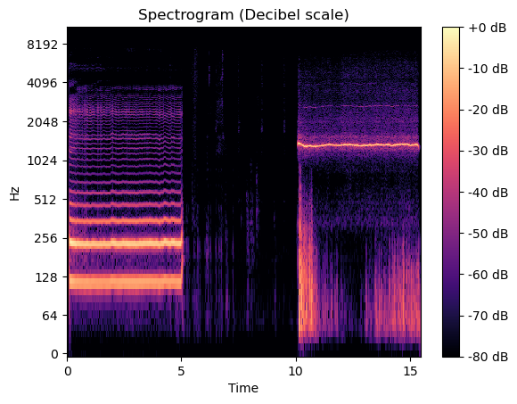

```{=html}
<style>
p.caption {
  font-size: 0.6em;
}
</style>
```

------------------------------------------------------------------------

```{r setup, include=FALSE}
knitr::opts_chunk$set(echo = TRUE, fig.align = 'center')
```

```{r package and seed, message=FALSE, warning=FALSE}
# Libraries -------------------------------
library(ggplot2)
library(plotly)
library(extraDistr) #needed for the rademacher distr 

# Seed for reproducibility ----------------------------
set.seed(26111998)
```

# Exercise 1:

## Population selected

```{r populations, message=FALSE, warning=FALSE}
# Population -------------------
n = 1000000
# basic population we want to try...N(0,1)
pop = rnorm(n)
# second population we want to try... RADEMACHER DISTR
pop_rad = rsign(n)
```

The first thing to do to solve the exercise is find two subgaussian
distributions, from which we'll extract two different populations.

The first one we choose is the **Standard Gaussian**, that satisfies the
subgaussianity requirement (since they are defined as distributions whose tails
decay at least as fast as those of a Gaussian) and it's also a "comfortable"
distribution to work with for us since we are familiar with it.

```{r plot Gaussian, echo=FALSE, fig.align='center', fig.cap="Histogram of the data from a Normal and the real Normal distro, they are the same because we have a population size of 100000", fig.dim=c(8,3), warning=FALSE}
df_normal <- data.frame(x = pop)

plot_normal <- ggplot(df_normal, aes(x = x)) +
  geom_histogram(aes(y = ..density.., fill = "Population"), binwidth = 0.2, color = "black") +
  stat_function(aes(color = "Gaussian"), fun = dnorm, args = list(mean = mean(pop), sd = sd(pop)), size = 1) +
  scale_fill_manual(values = "#f2e8cf") +
  scale_color_manual(values = "#d4a373") +
  labs(title = "Normal Distribution Density", x = "Values", y = "Density") +
  theme_light() +
  theme(text = element_text(family = "serif"),
        plot.background = element_rect(fill = "#004b23", colour = "#004b23"),
        title = element_text(colour = "white"),
        plot.title = element_text(size = 16),
        axis.line = element_line(color = "white"),
        axis.text = element_text(color = "white", size = 10),
        axis.title = element_text(color = "white", size = 10),
        legend.title = element_text(color = "white", size = 10),
        legend.text = element_text(size = 10, color = 'white'),
        legend.key = element_rect(color = NA, fill = NA),
        legend.key.size = unit(0.6, "cm"),
        legend.background = element_rect(fill = NA)) +
  guides(fill = guide_legend(title = ""), color = guide_legend(title = NULL))
plot_normal
```

The second distribution we chose is the **Rademaker distribution**, which is
the distribution of a step in the symmetric random walk: it takes values
1 and -1 with equal probability:

\begin{equation*}
  f(k)=\left\{\begin{matrix}
\frac{1}{2} & if & k = -1 \\ 
\frac{1}{2} & if & k = +1 \\  
 0 & otherwise 
\end{matrix}\right.
\end{equation*} 

This distribution is subgaussian:

-   For $t$ in $[-\infty, 1]$: \begin{equation*}
    1 = \mathbb{P}(|X| ≥ t) ≤ 2 \exp(0) ≤ 2 \exp(t^2)
    \end{equation*} Since the exponential is an increasing function and
    it takes value 1 at 0;

-   For $t$ in $[1, + \infty)$: \begin{equation*}
    0 = \mathbb{P}(|X| ≥ t) ≤ \exp(t^2)
    \end{equation*} Since the exponential takes only positive values.

Now that we have the distributions, we extract a sample of $1.000.000$
units from each of them to simulate the two populations we are working
with.

## Systematic sampling

In order to both keep the sequentiality of the data from the population
and to simulate different time flows we sample the data using systematic
sampling in the following way:

-   we extract the index $i_{\text{start}}$ of the first sampling unit
    uniformly at random;

-   we define the "step" of the sampling process as follows by taking
    the floor of $\frac{n - i_{\text{start}}}{t_{\text{max}}}$, if this is
    bigger than 1, and 1 elseway. Note that in the previous equation $n$
    is the population size and $t_{\text{max}}$ is the maximum sample
    size we want to examine, as stated in the homework text;

-   we collect the first ${t_{\text{min}}}$ indices spaced by "step"
    starting from $i_{\text{start}}$, where ${t_{\text{min}}}$ is the
    minimum sample size we want to take into consideration (in this case
    is set at $10$);

-   we extract the starting sample by getting the population vector
    items whose indices are the ones we collected.


```{r sampling, message=FALSE, warning=FALSE,  class.source = "fold-show", eval=FALSE}

start_sample_systematic <- function(population, tmin, tmax){
  if(tmax < length(population)){
    start_idx = sample(1:length(population), size = 1)
    
    if (start_idx + tmax > length(population)){
      return( start_sample_systematic(population, tmin, tmax) )
    }
    
    #fix the step for the systematic sampling
    step = floor( ((length(population) - start_idx) /tmax) )*( ((length(population) - start_idx)/tmax) >= 1 ) + 1* ( ((length(population) - start_idx)/tmax) < 1 )
    final_idx = start_idx + step*(tmin - 1)
    idx_vector_start = seq(start_idx, final_idx, step)
  }
  return(c(population[idx_vector_start], final_idx, step))
}

```

Since in the function we defined we return also the step of the sampling
process, we can update the starting sample in order to increase its size
by adding one sampling unit at a time following the same sampling rule.
This is what we do inside the loop that defines one iteration of the
simulation.

## Confidence Sequences and Confidence intervals computation

One of the important things left is the computation of the confidence
intervals and sequences requested for the analysis. To be able to do so, we
defined some functions that calculate them following their definitions:

```{r CI and CS functions, message=FALSE, warning=FALSE,  class.source = "fold-show", eval=FALSE}
# Confidence sequence for sample of size t
C_Sequence <- function(smpl, t, alpha){
  smpl_m = sum(smpl)/t
  term <- 1.7 * sqrt((log(log(2*t))+0.72*log(10.4/alpha))/t) 
  CS = c(smpl_m-term,smpl_m+term)
  return(CS)
}

# "Relaxed" confidence sequence for sample of size t
C_Sequence_relaxed <- function(smpl, t, alpha){
  sigma_hat <- var(smpl)
  smpl_m = sum(smpl)/t
  term <- sigma_hat * 1.7 * sqrt((log(log(2*t))+0.72*log(10.4/alpha))/t) 
  CS = c(smpl_m-term,smpl_m+term)
  return(CS)
}

#Hoeffding CI
CI_Hoeff <- function(sequence, alpha, a, b){
  n <- length(sequence)
  t_alpha = sqrt( ((b-a)^2/(2*n)) * log(2/alpha) )
  sample_mean = mean(sequence)
  return(c(sample_mean-t_alpha, sample_mean + t_alpha))
}

# Chebyshev CI
CI_Cheb <- function(sequence, alpha, sigma){
  n <- length(sequence)
  t_alpha = sigma / sqrt(n*alpha)
  sample_mean = mean(sequence)
  return(c(sample_mean-t_alpha, sample_mean + t_alpha))
}

# Gaussian CI
CI_Gauss <- function(sequence, alpha){
  n <- length(sequence)
  z_alpha2 = qnorm(1-alpha/2)
  std_err = sd(sequence)
  sample_mean = mean(sequence)
  return(c(sample_mean - z_alpha2*(std_err/sqrt(n)), sample_mean + z_alpha2*(std_err/sqrt(n)) ))
}

```

## Metrics

In order to compare the performances of the confidence sequences and confidence
intervals, we need to define some relevant metrics. We decided to use the ones
suggested in the homework text: the *Average running length* and the
*Cumulative Miscoverage Probability* that, when running the simulation, are
summarized w.r.t. the sample size. To be able to calculate them, when running
the simulation we saved some information needed for their computation:

-   **CMP** - for each interval (both the ones in the sequences and the
    "singular" ones) we keep track of the presence in the interval of
    the "true mean" of the distributions from which the populations are
    extracted: we save a $1$ if the true mean is inside the interval and a
    $0$ if it isn't;

-   **ARL** - we compute the length of each interval and save it.

Then, those values are summarized:

-   By calculating, for each sample size $t$ in
    $\{ t_{\text{min}}, \, t_{\text{min}} + 1, \dots, \, t_{\text{max}} \}$
    the CMP as
    $\frac{M - \sum_{ I \in I_t } \mathbb{1}_{\{ \mu \in I \}} ( \text{I})}{M}$,
    where $M$ is the simulation size, and $I_t$ is the set of confidence
    intervals of a given type calculated on samples of sample size $t$.

-   By taking the mean of the lengths of intervals of each of the
    examined sample sizes to get the ARL.

## Results and Analysis

To get the results, we did a simulation of size $1.000$ and saved the
results in one row of a dataframe for each sample extracted. In each
iteration of the simulation we let the sample size vary between
$t_{\text{min}} = 10$ and $t_{\text{max}} = 5.000$.

```{r parameters, message=FALSE, warning=FALSE, eval=FALSE}
# Parameters ------------------------------
M <-  1000
alpha <- 0.05
tmin = 10 
tmax = 5000
```

```{r simulation, message=FALSE, warning=FALSE, eval=FALSE}
# GAUSSIAN POPULATION

# initialize vector of sample sizes 
t_vec = seq(tmin, tmax)
# Initialize true mean and variance of the population - needed for coverage measure
true_mean = 0 # change as needed
sigma = 1 #change - it's the population TRUE standard deviation

# Initialize data frame to save CS bounds (and associated sample sizes)
bounds = data.frame()

for(it in seq(1, M)){ # M is the simulation size, fixed somewhere above 
  # extract starting sequence for the confidence sequence - FORSE NON DOVEVO FARE UNA FUNZIONE 
  start_output = start_sample_systematic(pop, tmin, tmax)
  sequence = start_output[1:tmin] # initial sample
  final_idx = start_output[length(start_output) - 1 ] # index of the last element in the sample
  step = start_output[length(start_output)] # step of the systematic sampling 
  
  # Initialize empty dataframe for the data of the iteration
  df_prov = data.frame()
  for(t in t_vec){
    # Calculate CI of the CS with sample size t
    CS <- C_Sequence(sequence, t, alpha)
    # Calculate CI of the relaxed CS with sample size t
    CS_relaxed <- C_Sequence_relaxed(sequence, t, alpha)
    #CI with Chebyshev
    CI_C <- CI_Cheb(sequence, alpha, sigma)
    #Gaussian CI
    CI_G <- CI_Gauss(sequence, alpha)
    
    ##### Info for the coverage metric
    TrueMeanIn_CS = (CS[1]<=true_mean) * (true_mean <= CS[2])
    TrueMeanIn_CSrelaxed = (CS_relaxed[1]<=true_mean) * (true_mean <= CS_relaxed[2])
    TrueMeanIn_Cheb = (CI_C[1]<=true_mean) * (true_mean <= CI_C[2])
    TrueMeanIn_Gauss = (CI_G[1]<=true_mean) * (true_mean <= CI_G[2])
    
    #### Length of the current intervals
    len_CS = abs(CS[1] - CS[2])
    len_CS_relaxed = abs(CS_relaxed[1] - CS_relaxed[2])
    len_Cheb = abs(CI_C[1] - CI_C[2])
    len_Gauss = abs(CI_G[1] - CI_G[2])
    
    # Save bounds and infos in the dataframe
    df_prov = rbind(df_prov, data.frame(sample_size = t, 
                                        CS_lower = CS[1], CS_upper = CS[2], TrueMeanIn_CS = TrueMeanIn_CS, length_CS = len_CS,
                                        CS_relaxed_lower = CS_relaxed[1], CS_relaxed_upper = CS_relaxed[2], TrueMeanIn_CSrelaxed = TrueMeanIn_CSrelaxed, length_CSrelaxed = len_CS_relaxed,
                                        Chebyshev_lower = CI_C[1], Chebyshev_upper = CI_C[2], TrueMeanIn_Cheb = TrueMeanIn_Cheb, len_Chebyshev = len_Cheb,
                                        Gaussian_lower = CI_G[1], Gaussian_upper = CI_G[2], TrueMeanIn_Gauss = TrueMeanIn_Gauss, len_Gaussian = len_Gauss
    ))
    
    
    # Update sample - in the end we will have one element more than needed in the sample
    sequence <- append(sequence, pop[final_idx + step])
    
    # Update final_idx
    final_idx <- final_idx + step
  }
  
  bounds <- rbind(bounds, df_prov)
}

# This is for the RADEMACHER
bounds_rad = data.frame()

for(it in seq(1, M)){ # M is the simulation size
  print(it)
  # extract starting sequence for the confidence sequence
  start_output = start_sample_systematic(pop_rad, tmin, tmax)
  sequence = start_output[1:tmin] # initial sample
  final_idx = start_output[length(start_output) - 1 ] # index of the last element in the sample
  step = start_output[length(start_output)] # step of the systematic sampling 
  
  # Initialize empty dataframe for this iteration
  df_prov = data.frame()
  for(t in t_vec){
    # Calculate CI of the CS with sample size t
    CS <- C_Sequence(sequence, t, alpha)
    # Calculate CI of the relaxed CS with sample size t
    CS_relaxed <- C_Sequence_relaxed(sequence, t, alpha)
    # CI with Hoeffidng bound : In this case no cause the Gaussian distr is not bounded
    CI_H  <- CI_Hoeff(sequence, alpha, -1, 1)
    #CI with Chebyshev
    CI_C <- CI_Cheb(sequence, alpha, sigma)
    #Gaussian CI
    CI_G <- CI_Gauss(sequence, alpha)
    
    ##### Info for the coverage metric
    TrueMeanIn_CS = (CS[1]<=true_mean) * (true_mean <= CS[2])
    TrueMeanIn_CSrelaxed = (CS_relaxed[1]<=true_mean) * (true_mean <= CS_relaxed[2])
    TrueMeanIn_Hoeff = (CI_H[1]<=true_mean) * (true_mean <= CI_H[2])
    TrueMeanIn_Cheb = (CI_C[1]<=true_mean) * (true_mean <= CI_C[2])
    TrueMeanIn_Gauss = (CI_G[1]<=true_mean) * (true_mean <= CI_G[2])
    
    #### Length of the current intervals
    len_CS = abs(CS[1] - CS[2])
    len_CS_relaxed = abs(CS_relaxed[1] - CS_relaxed[2])
    len_Hoeff = abs(CI_H[1] - CI_H[2])
    len_Cheb = abs(CI_C[1] - CI_C[2])
    len_Gauss = abs(CI_G[1] - CI_G[2])

    
    # Save bounds and infos in the dataframe
    df_prov = rbind(df_prov, data.frame(sample_size = t, 
                         CS_lower = CS[1], CS_upper = CS[2], TrueMeanIn_CS = TrueMeanIn_CS, length_CS = len_CS,
                         CS_relaxed_lower = CS_relaxed[1], CS_relaxed_upper = CS_relaxed[2], TrueMeanIn_CSrelaxed = TrueMeanIn_CSrelaxed, length_CSrelaxed = len_CS_relaxed,
                         Hoeffding_lower = CI_H[1], Hoeffding_upper = CI_H[2], TrueMeanIn_Hoeff = TrueMeanIn_Hoeff, len_Hoeffding = len_Hoeff,
                         Chebyshev_lower = CI_C[1], Chebyshev_upper = CI_C[2], TrueMeanIn_Cheb = TrueMeanIn_Cheb, len_Chebyshev = len_Cheb,
                         Gaussian_lower = CI_G[1], Gaussian_upper = CI_G[2], TrueMeanIn_Gauss = TrueMeanIn_Gauss, len_Gaussian = len_Gauss
    ))
    # Update sample 
    sequence <- append(sequence, pop[final_idx + step])
    
    # Update final_idx
    final_idx <- final_idx + step
  }
  
  # Update big dataframe
  bounds_rad <- rbind(bounds_rad, df_prov)
}

```
```{r metrics, message=FALSE, warning=FALSE, eval = FALSE}
cumulative_miscoverage_probability_bysize = data.frame()
average_length_bysize = data.frame()

for(size in t_vec){
  # Cumulative coverage by size - after save MIScoverage
  coverage_CS = sum(bounds$TrueMeanIn_CS[which(bounds$sample_size == size)])
  coverage_CSrel = sum(bounds$TrueMeanIn_CSrelaxed[which(bounds$sample_size == size)])
  coverage_Cheb = sum(bounds$TrueMeanIn_Cheb[which(bounds$sample_size == size)])
  coverage_Gauss = sum(bounds$TrueMeanIn_Gauss[which(bounds$sample_size == size)])
  
  
  # probability as nb of failures/ total number of try
  cumulative_miscoverage_probability_bysize <- rbind(cumulative_miscoverage_probability_bysize,
                                                     data.frame(sample_size = size,
                                                     CS = (M - coverage_CS)/M,
                                                     CS_relaxed = (M - coverage_CSrel)/M, 
                                                     Cheb = (M - coverage_Cheb)/M,
                                                     Gauss = (M - coverage_Gauss)/M) )
  
  # Average length 
  avlen_CS = mean(bounds$length_CS[which(bounds$sample_size == size)])
  avlen_CSrel = mean(bounds$length_CSrelaxed[which(bounds$sample_size == size)])
  avlen_Cheb = mean(bounds$len_Chebyshev[which(bounds$sample_size == size)])
  avlen_Gauss = mean(bounds$len_Gaussian[which(bounds$sample_size == size)])
  
  average_length_bysize <- rbind(average_length_bysize,
                                 data.frame(
                                 sample_size = size,
                                 CS = avlen_CS,
                                 CS_relaxed = avlen_CSrel, 
                                 Cheb = avlen_Cheb,
                                 Gauss = avlen_Gauss))
}

# RADEMACHER
cumulative_miscoverage_probability_bysize_rad = data.frame()
average_length_bysize_rad = data.frame()

for(size in t_vec){
  # Cumulative coverage by size - after save MIScoverage
  coverage_CS = sum(bounds_rad$TrueMeanIn_CS[which(bounds_rad$sample_size == size)])
  coverage_CSrel = sum(bounds_rad$TrueMeanIn_CSrelaxed[which(bounds_rad$sample_size == size)])
  coverage_Hoeff = sum(bounds_rad$TrueMeanIn_Hoeff[which(bounds_rad$sample_size == size)])
  coverage_Cheb = sum(bounds_rad$TrueMeanIn_Cheb[which(bounds_rad$sample_size == size)])
  coverage_Gauss = sum(bounds_rad$TrueMeanIn_Gauss[which(bounds_rad$sample_size == size)])
  
  
  # CMP as nb of failures/total number of try
  cumulative_miscoverage_probability_bysize_rad <- rbind(cumulative_miscoverage_probability_bysize_rad,
                                                     data.frame(sample_size = size,
                                                     CS = (M - coverage_CS)/M,
                                                     CS_relaxed = (M - coverage_CSrel)/M, 
                                                     Hoeff = (M - coverage_Hoeff)/M,
                                                     Cheb = (M - coverage_Cheb)/M,
                                                     Gauss = (M - coverage_Gauss)/M) )
  
  # Average length 
  avlen_CS = mean(bounds_rad$length_CS[which(bounds_rad$sample_size == size)])
  avlen_CSrel = mean(bounds_rad$length_CSrelaxed[which(bounds_rad$sample_size == size)])
  avlen_Hoeff = mean(bounds_rad$len_Hoeffding[which(bounds_rad$sample_size == size)])
  avlen_Cheb = mean(bounds_rad$len_Chebyshev[which(bounds_rad$sample_size == size)])
  avlen_Gauss = mean(bounds_rad$len_Gaussian[which(bounds_rad$sample_size == size)])
  
  average_length_bysize_rad <- rbind(average_length_bysize_rad,
                                 data.frame(
                                 sample_size = size,
                                 CS = avlen_CS,
                                 CS_relaxed = avlen_CSrel, 
                                 Hoeff = avlen_Hoeff,
                                 Cheb = avlen_Cheb,
                                 Gauss = avlen_Gauss))
}

```


To get an idea of how the length of the confidence intervals taken into
consideration behave w.r.t. the sample size, here we plot, for both the populations, the outcome of the running length of the intervals vs the sample size on one iteration of the simulation.


```{r plot for the Gaussian, echo=FALSE, fig.align='center', fig.cap="Plot of the different confidence intervals for the mean of the Gaussian distribution", fig.dim=c(12,5), warning=FALSE}
#bounds = read.csv("csvs/bounds.csv")
cutted = read.csv("csvs/Gauss_1iter.csv")
plot_n <- ggplot(data = cutted, aes(x = cutted$sample_size)) +
  geom_line(aes(y = cutted$CS_lower, col = "CS"), size = 1) +
  geom_line(aes(y = cutted$CS_upper, col = "CS"), size = 1) +
  geom_hline(yintercept = 0, linetype = "dashed") +
  geom_line(aes(y = cutted$CS_relaxed_lower, col = "CS_relaxed"), size = 1) +
  geom_line(aes(y = cutted$CS_relaxed_upper, col = "CS_relaxed"), size = 1) +
  geom_line(aes(y = cutted$Chebyshev_lower, col = "Chebyshev"), size = 1) +
  geom_line(aes(y = cutted$Chebyshev_upper, col = "Chebyshev"), size = 1) +
  geom_line(aes(y = cutted$Gaussian_lower, col = "Gaussian"), size = 1) +
  geom_line(aes(y = cutted$Gaussian_upper, col = "Gaussian"), size = 1) +
  labs(title = "Confidence set behaviour for the Normal population", y = "Mean", x = "Sample size") +
  scale_color_manual(values = c("CS" = "#d4a373", "CS_relaxed" = "#f2e8cf", "Chebyshev" = "#a7c957", "Gaussian" = "#6a994e"),
                     labels = c("Chebyshev", "CS", "CS_relaxed", "Gaussian")) +
  theme_light() +
  theme(text = element_text(family = "serif"),
        plot.background = element_rect(fill = "#004b23", colour = "#004b23"),
        title = element_text(colour = "white"),
        plot.title = element_text(size=16),
        axis.line = element_line(color = "white"),
        axis.text = element_text(color = "white", size = 10),
        axis.title = element_text(color = "white", size = 10),
        legend.title = element_blank(),
        legend.text = element_text(size = 10, color = 'white'),
        legend.key = element_rect(color = NA, fill = NA),
        legend.key.size = unit(0.6, "cm"),
        legend.background = element_rect(fill = NA))
plot_n

```
```{r plot for the Rademacher, echo=FALSE, fig.align='center', fig.cap="Plot of the different confidence intervals for the mean of the Rademacher distribution", fig.dim=c(12,5), warning=FALSE}
#bounds_rad = read.csv("csvs/bounds_rad.csv")
cutted_rad = read.csv("csvs/Rad_1iter.csv")
plot_rad <- ggplot(data = cutted_rad, aes(x = sample_size)) +
  geom_line(aes(y = CS_lower, col = "CS"), size = 1) +
  geom_line(aes(y = CS_upper, col = "CS"), size = 1) +
  geom_hline(yintercept = 0, linetype = "dashed") +
  geom_line(aes(y = CS_relaxed_lower, col = "CS_relaxed"), size = 1) +
  geom_line(aes(y = CS_relaxed_upper, col = "CS_relaxed"), size = 1) +
  geom_line(aes(y = Chebyshev_lower, col = "Chebyshev"), size = 1) +
  geom_line(aes(y = Chebyshev_upper, col = "Chebyshev"), size = 1) +
  geom_line(aes(y = Gaussian_lower, col = "Gaussian"), size = 1) +
  geom_line(aes(y = Gaussian_upper, col = "Gaussian"), size = 1) +
  geom_line(aes(y = Hoeffding_lower, col = "Hoef"), size = 1) +
  geom_line(aes(y = Hoeffding_upper, col = "Hoef"), size = 1) +
  labs(title = "Confidence set behaviour for the Rademacher population", x = "CS values", y = "Sample size") +
  scale_color_manual(values = c("CS" = "#d4a373", "CS_relaxed" = "#f2e8cf", "Chebyshev" = "#a7c957", "Gaussian" = "#6a994e", "Hoef" = "#f2cc8f"),
                     labels = c("Chebyshev", "CS", "CS_relaxed", "Gaussian", "Hoeffding")) +
  theme_light() +
  theme(text = element_text(family = "serif"),
        plot.background = element_rect(fill = "#004b23", colour = "#004b23"),
        title = element_text(colour = "white"),
        plot.title = element_text(size=16),
        axis.line = element_line(color = "white"),
        axis.text = element_text(color = "white", size = 10),
        axis.title = element_text(color = "white", size = 10),
        legend.title = element_blank(),
        legend.text = element_text(size = 10, color = 'white'),
        legend.key = element_rect(color = NA, fill = NA),
        legend.key.size = unit(0.6, "cm"),
        legend.background = element_rect(fill = NA))

plot_rad
```

For both populations, and this particular outcome, we can see that the
running length of all the types of CIs we took into consideration
decreases, and seems to be more or less stabilized after a certain value of the
sample size. Note this is not necessarily a consistent behavior since the plot above
is made by only one run of the simulation, we will see if our hypothesis is
confirmed by the analysis of the Average Running Length.

To be able to perform this kind of analysis, we now summarize the measurements
we got from the simulation as explained in the section "Metrics".

### Average Running length analysis

First of all, let us highlight that we didn't calculate the Hoeffding bound
since this distribution doesn't have a bounded support.
For the other type of confidence intervals/sequences we had to compute, here we
have a plot of their average running length behavior.

```{r plot of running length, echo=FALSE, fig.align='center', fig.cap="Plot of the different length of the confidence intervals fo the Normal distribution", fig.dim=c(12,5), warning=FALSE}
average_length_bysize <- read.csv("csvs/AVR_gauss.csv")
length_n <- ggplot(data = average_length_bysize, aes(x = sample_size)) +
  geom_line(aes(y = CS, col = "CS"), size = 1) +
  geom_line(aes(y = CS_relaxed, col = "CS_relaxed"), size = 1) +
  geom_line(aes(y = Cheb, col = "Chebyshev"), size = 1) +
  geom_line(aes(y = Gauss, col = "Gaussian"), size = 1) +
  labs(title = "Average interval length for the Normal population", y = "Length", x = "Sample size") +
  scale_color_manual(values = c("CS" = "#d4a373", "CS_relaxed" = "#f2e8cf", "Chebyshev" = "#a7c957", "Gaussian" = "#6a994e"),
                     labels = c("Chebyshev", "CS", "CS_relaxed", "Gaussian")) +
  theme_light() +
  theme(text = element_text(family = "serif"),
        plot.background = element_rect(fill = "#004b23", colour = "#004b23"),
        title = element_text(colour = "white"),
        plot.title = element_text(size=16),
        axis.line = element_line(color = "white"),
        axis.text = element_text(color = "white", size = 10),
        axis.title = element_text(color = "white", size = 10),
        legend.title = element_blank(),
        legend.text = element_text(size = 10, color = 'white'),
        legend.key = element_rect(color = NA, fill = NA),
        legend.key.size = unit(0.6, "cm"),
        legend.background = element_rect(fill = NA))
length_n
```

As we can see from it, for a Standard Gaussian population, the average running
length of all this intervals is similar, except for the Gaussian Interval,
whose length is significantly smaller than the others'.
Bigger differences between different types of intervals can be seen for
smaller sample sizes: for a sample of size $10$, we can see that, on average, the
running length of the relaxed version of the confidence sequence is more than
the double of the one of the Gaussian interval, and all the others are more
than $1/3$ bigger of this one.

```{r plot average length for Rademacher, echo=FALSE, fig.align='center', fig.cap="Plot of the different length of the confidence intervals fo the Rademacher distribution", fig.dim=c(12,5), warning=FALSE}
average_length_bysize_rad <- read.csv("csvs/AVR_rad.csv")
length_r <- ggplot(data = average_length_bysize_rad, aes(x = sample_size)) +
  geom_line(aes(y = CS, col = "CS"), size = 1) +
  geom_line(aes(y = CS_relaxed, col = "CS_relaxed"), size = 1) +
  geom_line(aes(y = Cheb, col = "Chebyshev"), size = 1) +
  geom_line(aes(y = Gauss, col = "Gaussian"), size = 1) +
  geom_line(aes(y = Hoeff, col = "Hoef"), size = 1) +
  labs(title = "Average interval length for the Rademacher population", y = "Length", x = "Sample size") +
  scale_color_manual(values = c("CS" = "#d4a373", "CS_relaxed" = "#f2e8cf", "Chebyshev" = "#a7c957", "Gaussian" = "#6a994e","Hoef" = "#f2cc8f"),
                     labels = c("Chebyshev", "CS", "CS_relaxed", "Gaussian", "Hoeffding")) +
  theme_light() +
  theme(text = element_text(family = "serif"),
        plot.background = element_rect(fill = "#004b23", colour = "#004b23"),
        title = element_text(colour = "white"),
        plot.title = element_text(size=16),
        axis.line = element_line(color = "white"),
        axis.text = element_text(color = "white", size = 10),
        axis.title = element_text(color = "white", size = 10),
        legend.title = element_blank(),
        legend.text = element_text(size = 10, color = 'white'),
        legend.key = element_rect(color = NA, fill = NA),
        legend.key.size = unit(0.6, "cm"),
        legend.background = element_rect(fill = NA))
length_r

```

For the Rademacher population the situation is a bit different, but the
considerations made above are still valid. We can now also analyze the
behavior of the Hoeffding interval: the average running length of this type of
interval is in between the one of the Gaussian interval and all the others,
whose ARL is almost the same.

Further analysis on this measures can be made w.r.t. the Cumulative Miscoverage
Probability: the two quantities need to be analyzed together if we want a more
comprehensive view of the situation.

### Cumulative Miscoverage Probability

For the Gaussian population, these are the values of the CMP w.r.t. the sample
size:

```{r table Gaussian, echo = FALSE}
cumulative_miscoverage_probability_bysize <- read.csv('csvs/CMP_gauss.csv')
cumulative_miscoverage_probability_bysize[c(
  which( (cumulative_miscoverage_probability_bysize$sample_size) == c(10)), 
  which( (cumulative_miscoverage_probability_bysize$sample_size) == c(100)),
  which( (cumulative_miscoverage_probability_bysize$sample_size) == c(500)),
  which( (cumulative_miscoverage_probability_bysize$sample_size) == c(1000)),
  which( (cumulative_miscoverage_probability_bysize$sample_size) == c(2500)),
  which( (cumulative_miscoverage_probability_bysize$sample_size) == c(5000))
  ), c(2,3,4,5,6),]
```

For this population, as we can see from the table above, all the types
of CIs, except from the Gaussian, have Cumulative Miscoverage Probability that
is significantly below the $\alpha$ required. On the other hand, the Gaussian
interval doesn't have this behaviour: for "small" sample sizes (reasonably,
sample sizes below 30), that's what we expected, but this is very unlikely for
"big" sample sizes, since the Gaussian Interval is asymptotic, thus increasing
the sample size should lead to a better estimate of the parameter.

```{r table Rad, echo = FALSE}
cumulative_miscoverage_probability_bysize_rad <- read.csv('csvs/CMP_rad.csv')
cumulative_miscoverage_probability_bysize_rad[c(
  which( (cumulative_miscoverage_probability_bysize_rad$sample_size) == c(10)), 
  which( (cumulative_miscoverage_probability_bysize_rad$sample_size) == c(100)),
  which( (cumulative_miscoverage_probability_bysize_rad$sample_size) == c(500)),
  which( (cumulative_miscoverage_probability_bysize_rad$sample_size) == c(1000)),
  which( (cumulative_miscoverage_probability_bysize_rad$sample_size) == c(2500)),
  which( (cumulative_miscoverage_probability_bysize_rad$sample_size) == c(5000))
  ), c(2,3,4,5,6,7),]
```

Besides, for the Rademacher population we get similar results in terms of
general behaviour: for all the confidence intervals/confidence sequences the
CMP is significantly below the level required, except for the Gaussian CI.
However this time this interval's CMP evolution is more similar to what the
expected one: it's above $0.05$ with a sample size equal to ten, and then
floats around the required level. Moreover, also the Hoeffding's interval, that we didn't analyze before, has a CMP consistently below $0.05$.

One more thing that we want to highlight is the CMP of $0$ reached by the
Confidence Sequence and Chebishev interval for both the Gaussian and the
Rademacher population.

### Conclusions 

The aim of this exercise was to confront the performances of different types of
confidence sets for the mean of two 1-subgaussian populations. Let us recall
that, given all the ingredients needed, a set is a *good* confidence set
satisfies both the characteristics of having a given confidence level and that
of having a sufficiently small measure (in the case of intervals, length).
"Fortunately" the metrics we computed to evaluate the CS performance measure
exactly these two things. What is left to do is compare them, leveraging what
we said when analyzing each one of them. 

Under the considerations we just made, Hoeffding bound seems the go-to if we
are dealing with a population extracted from a distribution with bounded support,
but this requirement itself is obviously not satisfied by all 1-subgaussian
distributions (see the standard Gaussian itself).

The confidence sequence, the Chebyshev interval and the "relaxed version" of
the confidence sequence, have highly comparable performances since they have a
very low CMP - always or almost always $0$ - and their lengths don't seem to
differ from the plot, except that for very small sample sizes, for which
Chebyshev's interval length is bigger than the others. To distinguish between
these three intervals, another thing that can be done is look at the requests
for their computation (aka, the hypothesis that the distribution of both the
population and the estimated parameter have to satisfy).

For the sake of clarity, let us recall that we are conducting an analysis on
1-subgaussian populations, so this hypothesis is taken for granted, even if not
needed in the case of Chebyshev interval, which of course makes the
applicability of this type of interval broader, even if that's not what we want
to highlight here.

The hypothesis needed for this types of intervals are the following:

- Chebyshev's interval is based on Chebyshev's inequality, that requires only
to have an integrable distribution with finite non-zero variance;

- the confidence sequence we computed doesn't have any further requirements;

- its asymptotic version requires a population with a finite variance.

Given these observations, the only thing we can say is to use the confidence
sequence in case of a population with a non-finite variance.

The last interval type to analyze is the Gaussian one, that has
a behaviour significantly different from the others both in terms of ARL and
CMP. The first thing that capture our attention is that for *small sample
sizes*, every other type of interval should be preferred because of the high
CMP of this interval. For *big sample sizes*, since this interval's AVR is
smaller than the ones of the other intervals and the CMP floats around the
required level, we can interpret the previous analyzed intervals' CMP as
overshooting, and declare that the performances of the Gaussian interval are someway
"better". On the other hand, the ARL of all this types of interval are very
small, and also the Gaussian interval requires the population to have a finite
variance (it's based on the CLT), so it could not be applicable for some
distributions.

To conclude, these are only some considerations we can make on a "high-level"
perspective; determine which of the confidence set is better to use in practice
is application dependent, and could not be determined *a-priori*, but of course
having a summary of observations on the performance and requirements of these
types of intervals is a good start. 

# Exercise 2

## Introduction

The second proposed exercise asks us to *model in detail a sequential and
realistic experiment* over a study that wants to investigate correlations
between environmental sound levels and mood. We are asked to describe all the
phases of the experiment from the data gathering process, the tools used, the
population parameter of interest, interventions we plan to make and the
statistics used to get results over the obtained data.

## Specialization of the question

Given that the research question has been voluntarily loosely specified in the
exercise text we want to *decide and set a specialization for the study* we want
to address. In particular we decided to focus on the **effects environmental
noise can have over the concentration level of students during study sessions**.

We made this choice based on the fact that both the population and the
target of the study will be easily accessible to us since we can use
ourselves as subjects and the data gathering activity would be easily
superimposable with our daily routines during the winter exam session. Moreover
restricting from the general mood to a single but meaningful aspect can greatly
help the data gathering process, given that as we will describe later we
decided to use self-reports to get data from subjects and something *more
objectively measurable* than feelings or emotions can help to reduce the
subjectivity of the measurements taken by the subjects.

## Population

We described the subjects of our study simply as "students", this
generic specification makes us able to *easily adapt the size of the
population* over which gather the data for the study we intend to
perform. For a small-scale study, the **three members of our team**
would be sufficient while if we wanted to increase the scale of the
analysis we may take into exam all the students of the course.

Those two proposals however *bias our results* towards the behaviors of master
degree students, in particular those of Data Science. While there will
reasonably be a similarity with behaviors of master students of other scientific
disciplines the results may differ from what we could get from bachelor's
degree students, students of humanistic subjects or even younger students
frequenting high or middle school.

We can generalize the study even more by extending the population to many
different kinds of students, this could help us to generalize the results we
will obtain and even understand how age or studied subject may relate to the
focus levels, but that is beyond the scope of the study and requires an effort
far greater than what we can realistically do.

## Concentration levels

We need a way to measure or at least get a rough idea of the concentration
levels of every person in the experiment over the time period we intend to
analyze. We asked *ChatGPT* to provide a list of ways to *measure the level
of focus of someone studying*, we briefly report here those that seemed the
more meaningful:
    
-   **Task Completion:** the subjects are asked to solve assignments as
    problem-solving tasks, standardized cognitive tests or reading 
    comprehension activities.
-   **Self-Report:** the subjects use a subjective numeric scale to rate their 
    concentration periodically. Advantages of this approach are the ease of
    understanding for the user and the fact that it allows the user to compare
    the current focus level with the previous ones.
-   **Biometric Data:** understand the focus on an individual by measuring 
    physiological indicators such as heartbeat rates, electroencephalogram or 
    the traking of eye movements.
-   **Behavioral Observations:** researchers observe and document behaviors of
    the subjects during the study sessions and then convert this observational
    data into quantitative measures.

Since we are asked to provide a *realistic experiment* we are forced to
remove the last two proposals, they would require specialized equipment
or a excessive amount of time to observe subjects and knowledge to
understand their behavior.

Given that we want to understand the measure of focus of the individual
solely about the studying activity we believe it's *important to avoid
the eventuality that the assessment process itself may be distracting
the subject*; we need it to be short and immediate to complete, we
therefore decided to go for using a **self-reported scale of
concentration**.

For the **granularity of the data** we want a scale that has multiple choices to
increase the precision of the measurements and to give the user a better way to
compare previous and current perceived focus levels, but an excessive
granularity may overwhelm the user and increase the time of the decision making
process, with the risk of falsifying the data. We believe **a scale that spans
from 1 to 10** to be the best compromise, also because the same scale range is
often used in different surveys and subjects may be more accustomed to use this
scale.

Another factor to decide is the **frequency of the measures**, how often we
ask the subjects for a new measurement of their focus level. We require
the requests to not be deteriorating of the focus level they want to
measure by being too frequent but also to be frequent enough in such a way
that the single value given by the measurement is a good estimate of the
overall focus level for the span of time it considers. Taking into account
both those considerations we believe time spans of about **30 minutes / 1 hour**
to be a good compromises.

## Enviromental sound levels

The other type of measurement we need to realize is about the *level of
noise experienced by the subjects*. We could insert this factor in the
measurement report the subject needs to compile, but since unlike the
mood *this measure is objective* it can also be obtained without human
intervention by using audio recording apps on the subjects phones, to
record the ambient noise levels during study hours and to be later be
analyzed to extract any kind of meaningful information we may want.

This approach is particularly welcomed in our study since it *requires no
further interruptions by the subject*.

Furthermore we could consider to classify the noise experienced by the
subjects into two classes by asking to the user the following question
during the measurements: *"Do you believe the noise you experienced in
this time span to have improved, worsened or not influenced your
focus?"*

In this way we would be able to distinguish between those sounds that
subjects may find distracting as other people talking, traffic or
construction sites and sounds that some people may instead even find to
help focus, as white noise or instrumental music. Moreover the answer to this
question can help us understand the noise tolerance level of the target for
that specific time span.

## What is sound?

What kind of data do we want to extract from the audio files? To know what
would be useful to use we first need to **understand what is sound and how
digital sound and human hearing works**. Sound is a vibration that propagates
trough air and is perceived by humans when the waves hit their ears and the
vibration of bones inside the ear is converted into nerve signal that brain
can elaborate. Microphones work in a very similar way, the sound waves make a
diaphragm vibrate and the oscillations are translated into an electrical
current.

Sound (as any other type of waves) can be described by two components:
**frequency** and **amplitude**. Frequency represents how fast the wave
oscillates, it is measured in *Hertz* (Hz) and humans can usually perceive
sounds in the range from 20 to 20.000 Hz, with the upper limit diminishing with
the age. Amplitude represents how "strong" the oscillation is, it is measured
in *Bels* (but Decibels dB are more used) with a logarithmic scale, this because
the way humans interpret the increase of amplitude is better represented by a
logarithmic scale and therefore dB are more easily interpretable. The lowest 
humans can usually hear is 0 dB but those are extremely faint sounds, even only
a whisper is around 30 dB, while there is no real upper limit, but sounds above
120 dB can be dangerous, cause pain and even inflict permanent damage to the
hearing system.

<center>
{width=75%}
</center>

<br>It is important to note that *what we hear is usually a sum of
different waves*, each with its own frequency and amplitude. In the digital
world this decomposition is made with the use of **Fourier Transforms**.

The first thing we can do to understand what our audio file contains is to use
them to create *spectrograms*, visual representations of frequencies spectrum of
an audio signal where usually the x-axis represents time, the y-axis frequency
and the color of the heatmap represents the amplitude of the frequencies at a
given point in time. To create this kind of data from the audio file we will
use *Python* and the library *Librosa*.

We show below an example on a "toy" audio file of 15 seconds created using a
phone microphone. The audio contains a person humming for 5 seconds, background
noise for other 5 seconds and a person whistling for the last 5 seconds.

<center>
{width=50%}
</center>

<br> We can observe very distinct behaviors between the three parts of the
test: the humming produced various wavelengths of noticeable strength, the
second part shows some background noise in the lower frequencies and the
whistling produced a very strong line in a very small frequency band.

We can also observe that the scale of the decibels has 0 dB as the highest
value and every other value as negative. This is because differently from
analog sound *in digital sound 0 dB is the reference point*, usually meaning the
limit of the tool used and therefore every other measure will be below it.

While the measure of sound as a physical phenomenon is totally objective it's
important to point out that the *percieved loudness* of a sound is instead a
subjective measure and moreover does not depend solely on the amplitude of the
wave but also in part on the frequency. In fact it can be shown with
*Equal-loudness contours plots* that humans have a better sound perception for
sounds in the middle of their hearing range with peaks around 2kHz-4kHz,
probably due to evolutionary reasons, as sounds of animals and other humans
usually fall in that range.

<center>
{width=50%}
</center>

<br> There is no exact formula that can capture the perceived loudness of a
sound, we are therefore forced to use subjective measures. The first thing we
can extract can be a measure of the average loudness of the audio. A measure
often used with this objective is **Root Mean Square Energy**, where Root Mean
Square has the same mathematical meaning we already know:

$RMS = \sqrt{\frac{1}{N} \sum_{i = 1}^N|x_i^2|}$

Here $x_i$ is the amplitude for frequency $f_i$. We take the RMS Energy of each
discrete time unit and we take the sum to get a measure of "Energy per hour".
This measure give us a good summary for the overall behavior of the amplitude
of the sound we analyze, we can use as second feature something that
get us a summary for the frequency in a similar way.

What we can use in this case is the **Spectral Centroid**, defined as the center
of mass of the spectrum for a certain discrete time unit. To calculate it we
can just take the weighted mean of the frequencies in the signal:

$SP = \frac{\sum_{i=1}^Nf_i*x_i}{\sum_{i=1}^Nx_i}$

And as before to get a summary for the whole audio file we take the mean of the
spectral centroids of every discrete time unit in the audio file.

## Focus report 

About the tools used to gather those reports we will need *two components* to
create an efficient pipeline, a system to notify the user when it's time to
fill out a new report and a way to make the user easily and quickly compile
the report and move data from the subject to us.

As we have said before it is imperative for us to avoid as much as possible
the disruption of the workflow of the subject, we therefore need the data
gathering process to not be intrusive.

A very *fast way make the subjects fill out reports* is via the use of
**Google Forms**, a web application part of the Google Workspace Suite that
allow us to create online forms accessible by simply sharing a link. In just a
few seconds and only 5 clicks the subject will be able to send the report
containing its responses, its email address to make us able to identify the
subject and the delivery timestamp to understand the time span the report is
about. The reports *results are automatically exported* into a **Google Sheet**
table containing all the responses from all the subjects.

Google forms are also *extremely versatile*, permitting the subjects to access
and compile them via browser, therefore they can be accessed via Personal
Computer or Smartphone without the need to download any specific app. The
submission of a new report is also very easy for the subject as it's just
needed to use the same link or click on "submit another response" over the
previously completed form.

<center>
{width=75%}
</center>

<br>For the user notification system the *best approach to use depends on the
user* itself, we believe the user should select its preferred way of being
notified to write the report. The two main proposals we make are:

-   A simple visual notification system, ideal when the subject is working on
    a computer and is constantly looking at the screen as its very discrete
    and not interrupting of the user workflow. As app we found to implement
    this is **Custom Notifications 10** for Windows systems
    (https://apps.microsoft.com/detail/9NBLGGH529DX).

<center>
    
</center>

<br>

-   A more intrusive approach considers the use of ringtones, for when the user
    is studying on physical books or handwritten notes; the ringtone is more
    distracting, but in this case a simple notification would be not enough as
    it could be mistaken for something else and lost. An app we propose to
    easily create multiple alarms separated by a certain time interval is
    **Repeat Alarm** for Android phones
    (https://play.google.com/store/apps/details?id=com.kittoboy.repeatalarm).

<center>
    {width=75%}
</center>

## Noise record and feature extraction

We have decided to take as approach to measure the noise experienced by the
subjects during a certain time span the recording of the nearby environment
sounds. The subject will only be asked to record the noise of the working
environment and analysis over it be performed on a later date.

There are a multitude of phone apps that permit the record of audio from the
microphone but the one we suggest is *Audio Recorder*  (https://play.google.com/store/apps/details?id=com.dimowner.audiorecorder),
given its lack of ads and the presence of personalization features to change
the file format, the sample rate, the bitrate and other settings.

<center>
    {width=30%}
</center>

<br>If the user is using devices as headphones to cover external noises the
recording of only the external audio may not be enough. We can argue that if
the user is deliberately exposing itself to sounds during studies those will be
positive to its focus, but in the case we would
want to study those sounds we will need to record also internal phone audio.
While we haven't been able to find an audio-recording app capable of record both
internal and external audio the *default Android screen recorder* has this
capability, at the expense recording also the device screen and therefore
forcing us to separate the audio from the video in a second moment.

For the features extraction part as said before we will use *Python* and the
library *Librosa*. We wrote a simple script capable of extracting the requested
features. This file will be submitted together with the rest of the homework. As
examples to show the output of the script we now show the Rooted Mean Square
Energy and the Spectral Centroid for the previous test audio file and for
another file recorded in a quiet room with only the sound of a laptop fan:

*Test 1 RMS: 15637.07*<br>
*Test 1 SP: 1766.15*

*Test 2 RMS: 78.79*<br>
*Test 2 SP: 2759.68*

## IID Sampling problem

The setup we have built has some problems about the sampling
independence: since we are taking measurements over study sessions of
certain individuals hour by hour there will be *temporal dependences*
over the measurements, the current day *general mood* of the analyzed
person works as a *hidden variable* that can interfere with the focus
measurements of the day.

The temporal dependence causes also a dependence in the measured noises
as a subject tends to stay in the same place during a study session and
the kind of environment heavily influences the noise levels that will be
observed: a library or a private room will be quieter than a public
study place or somewhere near a busy road.

It has also to be taken into account that extended study sessions may have
negative effect on the focus levels of the subject, we may observe a
diminishing of the concentration simply out of weariness of the subject.

We also have dependence given by the study subjects themselves: an individual
tends to have preferences over where to study and as discussed in the
previously this greatly influences the ambient noise levels that will be
experienced and measured.

Another kind of dependence given by the subjects are
the personal noise tolerance levels, some people may not find certain sounds
as distracting as others do and even this perception can be influenced by the
individual current mood or fatigue.

How can we remove or at least reduce the dependence between the
measurements?

The easier way to grant a good representation and diversity in the data is to
increase the number of people who participate to the experiment and to
diversify them by preferences and habits, but this approach seems not to be
easily applicable in our scenario given the limited amount of test subjects we
may be forced to work with.

To remove the temporal dependence of measurements carried out by the
same subject in the same study session we can take a single measurement for
the whole day or summarize all the measurements taken in a day into a single
result. This reduces the dependence we experience between consecutive
measurements, but also greatly reduces the amount of data we can work on and
does not take into account that the general mood and conditions of the
individual, that as we have said before can interfere with the measurements,
can influence or be influenced by those of adjacent days.

## Interventions

We might also want to plan some kind of interventions over the experiment setup
we built:

- **Noise-Cancelling Headphones**: headphones with noise-cancelling capability
can help reduce the perceived external ambient noise and therefore boost
students concentration. Noise cancelling can be implemented in a passive way by
physically blocking the sound from entering the ear and in an active way by
listening to the outside noise and cancelling it out with phase-inverted sound
waves, however the kind of cancellation has no interest for us.

- **"Positive" Environmental Noise**: substituting environmental noise with
something that could be beneficial to the focus of the user. Examples of this
kind of sounds are natural sounds like rain, running water, birds or
instrumental music as classical music or in general ambient music characterized
by a slow tempo and minimal dynamic changes.

## A/B Test and Confidence Sequences

As the Background section in the homework text mentioned, **A/B tests** are
randomized controlled and sequential experiments used for hypothesis testing
where *the testing environment is always the same except for a single variation
that might effect the target value*, with the purpose of measuring how this
single isolated variation can influence the target value.

This type of testing is often used to enhance engagement, clicks and in general
the user experience for website, given that for the case of webpages is very
easy to create simple variations of their contents and "distribute" those
variations among users, even without them knowing. One example of use of this
technique might be to decide which location of the ads in a certain webpage
yields the better click rate and therefore the highest earnings for the website.

Our experiment might use the same principles to test the hypothesis that
environmental sound levels affect focus levels. Our study like those carried
out for A/B testing is inherently sequential and we can occur in the same
problems described in the homework text: it's impossible to know a priori if a
certain sample size will be enough. Confidence Sequences can therefore greatly
help us in this scenario, permitting us to continuously monitor the experiment
and insert new data when they become available.

However there are also a *few differences* between what we are planning to do
and the heavily controlled and uniform scenario of a webpage: we haven't as much
control over the scenes presented to the user as a a webpage scenario can give,
meaning also that there could be variables that might influence the target value
and that we might haven't take into account. This may render our observations
imprecise, but as said before we can try to compensate those factors with a
greater sample size for the study and is in some part unavoidable, given that
to create a more controlled environment we would need an amount of effort and
resources unfeasible for a realistic experiment.